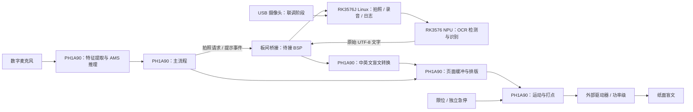

# AFC03 板载盲文打印机架构

当前目标是 **MLK-AFH03-AFC03-2GB LPDDR4X+32GB EMMC**，其中 RK3576J 运行 Linux，PH1A90SEG324 运行 FPGA 逻辑。它们是独立芯片，不能沿用 DR1 的片内 PS/PL AXI 地址或设备树。

## 部署位置

| 功能 | 位置 | 实现边界 |
| --- | --- | --- |
| 摄像头、拍照和 OCR 调度 | RK3576J Linux | 服务代码已加入；实拍尚未验证 |
| PP-OCR 文字检测与文字识别 | RK3576 NPU；CPU 做匹配模型的前后处理 | RKNN 加载/释放封装已加入；模型和整套前后处理未提供 |
| 短语录音播放、日志 | RK3576J Linux | 按 FPGA 事件播放本地 WAV；录音/声卡待准备 |
| 数字麦克风、声学特征、AMS 推理 | PH1A90 PL | 接口与模型清单，尚无权重或有效推理 |
| 主流程与基础英文转换 | PH1A90 PL | 保留应用 RTL，待板级桥接与综合 |
| 中文语言处理与盲文转换 | PH1A90 PL | 尚未实现，不能只按 Unicode 查一个六点单元 |
| 页面缓冲、排版、运动和打点 | PH1A90 PL | 待实现；物理输出保持禁用 |
| 图像采集、预处理、高速传输 | PH1A90 → RK，后续阶段 | 当前只有规划，没有声称实现硬件视觉加速 |
| 开发/训练/模型转换/调试 | 电脑 | 最终演示不依赖电脑；不做连续 ASR |

指南平台页列出 RK 的 6 TOPS NPU、2 GB LPDDR4X 和 32 GB eMMC，以及 PH1A90 的 240 DSP、5440 Kbit ERAM 和外部 DDR3L。资源用于估算，模型能否达到目标精度/速度须以量化、内存测量和板测为准。

## 数据流

此图表示目标分工。板间 JSONL v2 目前是软件适配层约定，PH1A90 并没有现成的 JSON 解析器。真正桥接须把消息映射为应用核心的握手、文本与状态端口。

最终视觉扩展路径为：相机 → PH1A90 采集/预处理 → 高速帧通道 → RK 前处理/NPU。若帧通道采用压缩图像，RK 必须先解压成模型要求的像素数据。不能把 JPEG 字节或任意二值图直接当作预训练 OCR 输入。

## 板间链路

指南列出 **MIPI 4 lane / PCIe 2.0 ×1**。实际选哪条、PCIe 的 RC/EP 角色、DMA 缓冲、驱动节点、控制通道和帧格式，必须以本板 BSP/原理图/例程为准；当前配置留空，不编造地址或引脚。

- 控制通道：关键词后的状态/拍照/提示，以及 OCR 文字，数据量小。
- 图像通道：整帧、行跨度、像素格式、时间戳、缓存同步，单独定义，不能塞进 JSONL。
- MIPI 图像链路不能自动视为双向命令链路；若选它，还需验证返向控制方式。
- USB-UART 可作调试或早期文字通信，但必须核对引脚归属，不是系统必须使用的最终图像链路。

## 工作流与 FPGA 主体性

“开始”由 PL 模型识别，PL 进入 WAIT_BOOK 并请求放书提示；“完成”触发 PL 请求拍照，RK 回传 OCR 文字。PL 完成整页校验、翻译与缓冲后才进入 READY；“打印”启动 PL 运动控制器，真实运动完成才进入 DONE。“取消”丢弃任务；“停止”/实体急停进入锁定错误，明确复位后恢复。

RK 服务没有关键词注入、盲文转换或电机控制 API。异步 OCR 允许接收取消状态，任务标识防止迟到结果进入新页。真实 PL 桥接仍须独立检查任务标识、链路故障和缓冲容量。

答辩准确描述：“OCR 部署在 RK3576 NPU；AMS 多关键词网络部署在安路 PH1A90 可编程逻辑；盲文转换和打印控制也由 PH1A90 完成。”目前这些是目标，模型未接入前不能作为已完成成果。

应保留 AMS 软件与定点/RTL 对照、综合 LUT/DSP/ERAM、板上推理计数与延迟；同时展示 OCR 和实际打印各自用时。仅显示一段模拟日志不足以证明 PL 推理。

## 竞赛范围

按用户提供指南的 PDF 文件页码，第 9–11 页是推荐平台 3，第 19–20 页列出选题三基础任务。选择 AFC03 不等于已经选择或满足该题：

- FPGA 摄像头采集；
- FPGA 至少 3 种图像预处理算法；
- JPEG/LZ77 硬件压缩；
- MIPI/PCIe 高速帧交互；
- RK NPU 轻量化目标检测，以及其余展示/性能交付要求。

本项目当前继续按**自主命题**组织。若明确报选题三，需要逐项补齐；不能未经确认就用 OCR 的文字检测阶段替代赛题要求的目标检测。当前 USB 摄像头直连 RK 是联调步骤，并不满足“FPGA 采集”。

资料依据：用户提供的《2026 FPGA 赛道选题指南—安路科技》；[Rockchip RKNN Toolkit2](https://github.com/airockchip/rknn-toolkit2)、[官方 RKNN Model Zoo](https://github.com/airockchip/rknn_model_zoo)。官方支持 RK3576 的模型转换/部署路径，不等于本仓库已部署或达到特定速度。
